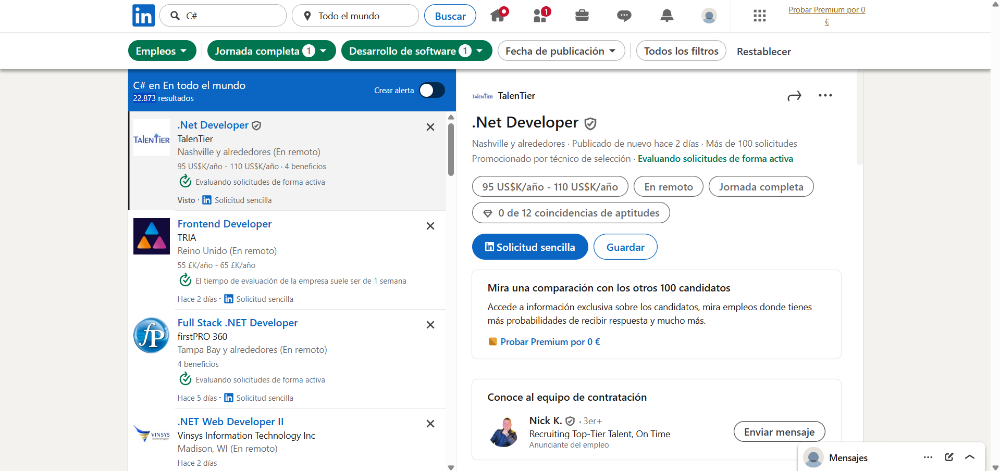
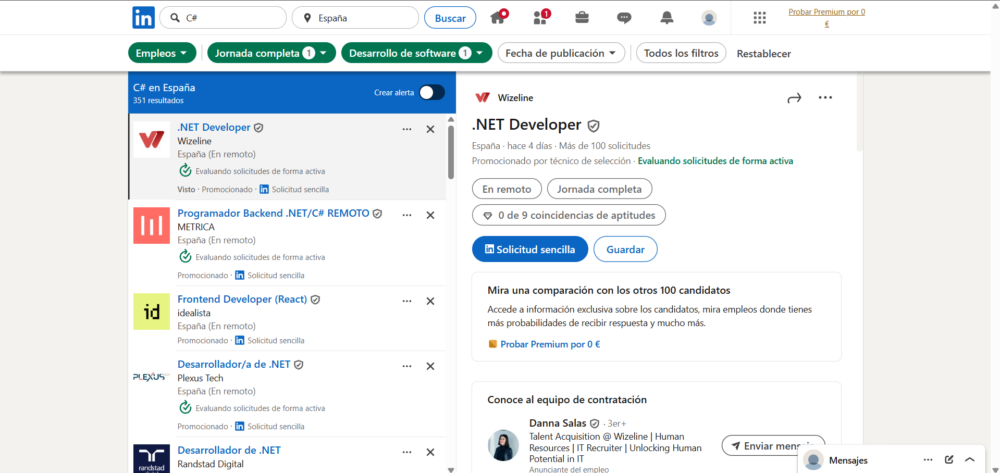

# Demanda-Laboral-Entornos
Filtros: Jornada completa y desarrollo de software.

## Java
- España: 3.135
- Mundial: 154.747
### Captura: Java a nivel mundial

### Captura: Java en España

## Python
- España: 3.188
- Mundial: 156.329
### Captura: Python a nivel mundial

### Captura: Python en España

## C#
- España: 351
- Mundial: 22.873
### Captura: C# a nivel mundial

### Captura: C# en España

## C y C++
- España: 529
- Mundial: 30.994
### Captura: C y C++ a nivel mundial

### Captura: C y C++ en España

## JavaScript
- España: 3.160
- Mundial: 157.577
### Captura: JavaScript a nivel mundial

### Captura: JavaScript en España

## PHP
- España: 263
- Mundial: 10.278
### Captura: PHP a nivel mundial

### Captura: PHP en España

## VB .NET
- España: 48
- Mundial: 6.122
### Captura: VB .NET a nivel mundial

### Captura: VB .NET en España

## Ruby
- España: 13
- Mundial: 423
### Captura: Ruby a nivel mundial

### Captura: Ruby en España

## Tabla comparativa
| Lenguaje   | Mundial | España |
|------------|---------|--------|
| JavaScript | 157.577 | 3.160  |
| Python     | 156.329 | 3.188  |
| Java       | 154.747 | 3.135  |
| C y C++    | 30.994  | 529    |
| C#         | 22.873  | 351    |
| PHP        | 10.278  | 263    |
| VB .NET    | 6.122   | 48     |
| Ruby       | 423     | 13     |
